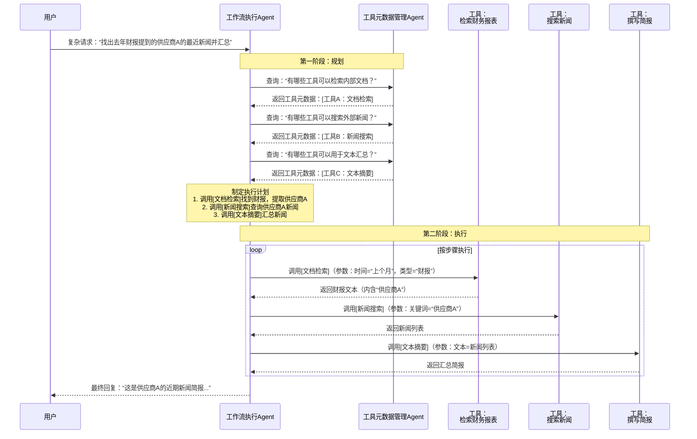

好的，专注于架构设计，我们来深入探讨一下**双Agent架构**。这是一种非常优雅且强大的设计模式，旨在解决工具调用中的复杂性、可维护性和可靠性问题。

### 核心理念：关注点分离

双Agent架构的核心思想是**将“规划”与“执行”这两个关注点分离开**，由两个专门的智能体（Agent）各司其职。这就像一支专业团队：
- **一个负责思考的“大脑”或“指挥官”**：它了解全局目标和可用资源，制定计划。
- **一个负责动手的“执行者”或“工兵”**：它精通各种工具的具体操作，忠实地执行命令。

这种分离带来了巨大的好处：
- **降低复杂性**：每个Agent只需专注于自己的任务，逻辑更清晰。
- **增强健壮性**：一个Agent的故障不会直接导致另一个Agent崩溃。
- **便于维护和扩展**：更新工具或修改规划策略可以独立进行。

---

### 双Agent的详细角色与职责

在一个典型的设计中，两个Agent的角色定义如下：

#### 1. 工具元数据管理Agent - **“工具专家”或“目录管理员”**

这个Agent就是你所设想的“专门管理工具的模型”。它是一个**静态的、知识性的**系统。

**核心职责：**
- **工具注册与存储**：维护一个所有可用工具的“目录”（例如，一个向量数据库或一个JSON文件），记录每个工具的元数据。
- **元数据管理**：对于每个工具，存储其：
    - **名称**：工具的标识符。
    - **描述**：工具功能的自然语言描述，用于语义匹配。
    - **参数模式**：调用所需的参数及其类型、是否必填等（符合OpenAPI Schema等标准）。
    - **使用示例**：（可选）提供调用示例。
    - **安全与权限**：（可选）标记工具所需的访问权限。
- **查询接口**：对外提供一个统一的查询接口。当被询问时，它能根据用户请求的语义，从工具目录中**检索、筛选并返回最相关的工具列表及其元数据**。

**它不负责**：实际调用工具或执行业务逻辑。

**它的提示词可能类似于：**
> “你是一个工具目录系统。你的知识库中包含以下工具：[工具列表]。当收到用户请求时，你需要分析请求内容，并从你的知识库中找出一个或多个可能完成该请求的工具，并返回这些工具的完整元数据信息（名称、描述、参数）。你不执行任何工具，也不回答工具功能之外的问题。”

#### 2. 工作流执行Agent - **“执行工兵”**

这个Agent是**动态的、操作性的**系统，负责驱动整个任务的完成。

**核心职责：**
- **任务理解与规划**：接收用户原始请求，并向“工具专家”咨询可用的工具。
- **计划制定**：基于“工具专家”返回的工具列表，规划出一个具体的、分步的执行步骤（Step-by-Step Plan）。
- **工具调用与执行**：严格按照规划，一步步地调用相应的工具，并传入正确的参数。
- **状态管理**：维护任务执行过程中的状态，处理上一步的输出并作为下一步的输入。
- **结果整合与响应**：收集所有步骤的执行结果，进行总结、提炼，最终生成对用户的响应。

**它不负责**：记忆所有工具的细节，它只在需要时向“工具专家”查询。

---

### 工作流程与交互时序

让我们通过一个具体的例子 **“请帮我找出上个月在财务报表中提到的供应商A的最近新闻，然后汇总成一份简报”** 来可视化整个流程：

### 架构优势与设计考量

**优势：**
1.  **高内聚，低耦合**：工具管理逻辑和 workflow 执行逻辑被清晰地隔离在不同的模块中。
2.  **极强的可扩展性**：添加一个新工具，只需要在“工具专家”那里注册一次，所有执行Agent都能立即通过查询来使用它，无需修改核心执行逻辑。
3.  **提升可靠性**：“执行工兵”的规划基于准确的工具元数据，减少了因工具信息错误导致的调用失败。
4.  **灵活性**：可以轻松地为不同的“执行工兵”配备同一个“工具专家”，实现工具能力的复用。

**设计考量：**
- **通信协议**：两个Agent之间需要通过清晰的协议进行通信。通常使用结构化数据（如JSON），内容就是工具的元数据列表和执行计划的步骤。
- **工具元数据标准化**：所有工具的描述、参数格式必须标准化，以便“工具专家”能统一管理和“执行工兵”能正确解析。**OpenAPI Schema**是一个完美的参考标准。
- **潜在的性能开销**：多了一次Agent间的通信，可能会增加少量延迟。需要在设计上优化查询（如一次查询获取所有可能相关的工具，而不是多次往返）。

这种双Agent架构，尤其是在工具数量众多、任务复杂的系统中，能极大地提升代码的可维护性和系统的整体智能水平。它完美地响应了你“构建一个模型去专门管理工具”的初衷。