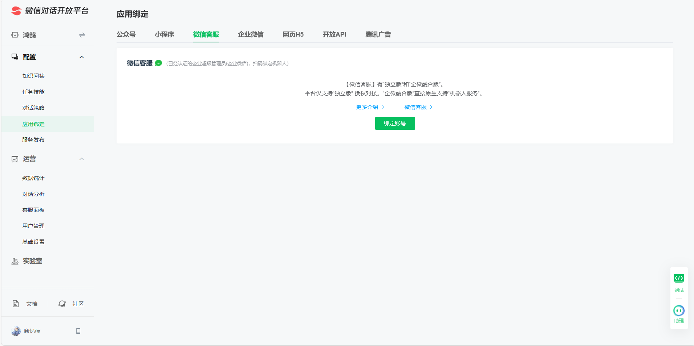

# 
(WBGO)微信后台操作

WBGO = WeChat background operation
- 微信多开控制
- 
- 好友或群聊消息监听
- deepseek自动回复
- 关键词自动回复(指定内容或AI处理)
- 处理加好友和加群的

## 注意事项
1. 新号建议不要用，刚创号上来就是疯狂加群和疯狂加好友。你说你没有非法目的谁信？腾讯对这一方面非常严格。可以去看新号养成守则
2. 处于编程和安全考虑：强烈建议单个系统单个微信。如果你不会处理异步同步，并发并行的问题建议单个微信不要多开。有可能导致死锁或乱分配资源
3. 打开并登录微信后，点击左上角的头像，如果弹出的窗口没有微信名、微信号、地区则需要自行查找原因排查
4. 代表点击后又会有所不同，没有地区和微信号(特例，目前没找到原因)

## 微信能发送的消息类型
1. 最常见的就是文本，单纯的文本(时间也是嵌入消息里面和QQ一样)
2. 引用类型(引用后附加的只能是文本类型)，引用别人的消息体。**引用类型加文件自动变成文件类型**
3. 语音
4. 表情
   1. 官方表情
   2. 非官方表情
5. 
6. 文件类型
   1. 图片
   2. 视频
   3. pdf
   4. word
   5. ppt
   6. excel
   7. 等等

## 控件歧义消除（Control Ambiguity Resolution）
此课题在QQBot的时候就困住我了，这里我将对他进行解决
问题原因：窗口名字、群聊名字、好友名字、群聊内人员的名字都可以进行重复。这就导致无法正确判定控件是否有效

### 应用场景：
1. 正常消息发送时如果出现2个及以上同名的好友或群聊就无法判断究竟发给谁了
2. 开启权限隔离时需要正确判断发送者(某些指令如退出指令需要进行判断)

### 实现方向
**窗口绑定歧义消除**

**能在窗口绑定产生歧义的就只有微信多开的情况**

如果微信多开且名字相同又得更麻烦了，需要通过控件(微信号、或图像)进一步确认了
业务逻辑思路：
1. 遍历顶层窗口，对于微信窗口这个顶层窗口控件可以通过类名(`ClassName`)判断，微信类名是："WeChatMainWndForPC" 微信聊天窗口的类名是:"ChatWnd"。通过类名和标题过滤掉非微信窗口(仅仅有1种情况是误判过滤窗口的，必须后台点击头像，这里就不纳入考虑了，这是非正常情况)
2. 拿到过滤后窗口读取头像控件的名字(微信名)，如果微信名重名则进行下一步
3. 遍历同名的微信窗口，后台点击头像按钮进一步读取微信号进行判断
**聊天同名歧义消除**

1. 天花板方案：给腾讯交钱(黑产)
2. 顶级方案：逆向微信的API接口，hook发送者的微信ID用来识别
3. 兜底方案：通过模拟点击的方案进行(如点击对方头像，群聊详细信息等) 等获得更多信息进行比对。判定用户用微信ID，群聊比较麻烦(拿到群主名或群名等更多信息进行比对)
4. 次级方案：拿到控件的图像进行对比
5. 垃圾方案：发现同名让用户改名(这是代码实现难度最低，收益最高的方案)

### 控件歧义记录
1. 好友和好友同名
2. 群聊和好友同名
3. 群聊和群聊同名
4. 微信窗口同名，比如我把好友窗口单独拉出备注名改成

***

如何获取好友列表微信号？
参考资料：https://github.com/automation9417/application-automation/tree/master/WechatSearch
需要解决：怎么获取所有微信好友，因为好友列表需要鼠标滚动才能逐步显示完全，但是通过鼠标滚动的话，又存在一个问题，每次滚动显示好友列表数量不好控制？这时候可以利用先选中好友列表第一个，然后按键盘上 Down 键，就可以发现按一次，好友列表下移一次
1. 点击微信侧边栏通讯录
2. 点击好友列表第一个
3. 开始循环发送快捷键{DOWN}
4. 获取当前选中微信好友微信号
   1. 通过Recorder 我们可以很轻松定位到微信号，但是怎么获取相邻元素显示微信号呢？这时候可以通过 ui(locator.wechat.contact_id).parent.child(1).get_text()方式获取，逻辑就是定位到微信号元素后，再通过代码获取父一级元素即可；
5. 判断当前选中是微信群还是企业微信号
   1. 通过录制判断，我们可以发现只有微信好友才会显示微信号，所以通过这个特征来区分
6. 判断下移好友列表到底
   1. 通过记录上一次微信和当前选中微信号，如果上一次微信号和当前微信号一致，就可以判断可以结束流程
***
## 致命缺点
如果是通过uiautomation读取就会有一个致命缺点:身份唯一标识符难以确认。
1. 一个群聊内可以出现2个名字相同的人，仅仅读取对方的名字无法判断是否为我要发送的人
2. 如果我给对方设置备注名那么重名后也无法确实这是不是我要真正发送的好友，群聊重名依旧会导致判定失效 

***

## 微信自动回复实现方向及代价
| 实现方向 | 正规性 | 限制 | 代价 |
| -------- | ------ | ---- | ---- |
| 企业微信机器人 | 官方API，安全稳定 | 必须先加入对应的企业、配置繁琐、无法参与群聊  | 公网IP的云服务器 |
| 企业微信客服号 | 官方API，安全稳定、不用加企业，点开即用 | 未认证企业只能服务100人、配置繁琐、无法参与群聊 | 公网IP的云服务器 | 
| 公众号订阅号 | 官方API，安全稳定 | 超时限制，字数限制、无法参与群聊 | 公网IP的云服务器 |
| 公众号服务号 | 官方API，安全稳定 | 无法参与群聊、部署成本较高 | 公网IP的云服务器、服务号认证费用、营业执照 |
| 个人微信 | 参与群聊加好友、部署成本低、普通微信号的一切功能 | 给账号带来风险、建议用小号 | |
API逆向、爬虫 | 非官方(实力不够会封) | 技术难度高 | 号多、喜欢研究 |

- 微信官方文档：https://developers.weixin.qq.com/doc/
- 微信对话开放平台：https://chatbot.weixin.qq.com/@eggaa1fc/platform/openAi/home

***

1.本项目是基于自主研发的DeepseekConversationEngine类库开发的示例程序，通过调用案例直观演示该库的功能特性与开发流程。
2.示例项目源码地址：https://github.com/yandifei/DeepseekConversationEngine/tree/main/调用示例/QQ机器人
3.核心类库仓库地址：https://github.com/yandifei/DeepseekConversationEngine
4.必须先在环境变量里配置好密钥，不懂的可以去看相关视频或查看文档目录下的deepseek对话引擎文件
5.优先查看文档解决问题，文档没有问AI(直接粘贴报错提示)或把报错发作者QQ邮箱:3058439878@qq.com
6.此程序的根本目的是打造接入DeepSeek的API接口实现“满分”的问题解答和为用户提供“情绪价值”
7.提供了预定的人设(已经调教好了)，文档中记载了自定义人设的方法，可自行查看修改
8.MIT协议保留原始版权可自由修改，禁止将该项目用于引流(带节奏)、纯色情、当键政等非法目的
9.如果您喜欢该项目或觉得该项目对您有所帮助，感谢您的使用。开源不易，如果可以请在项目根地址给我一个Start吧

如果要查看可使用的指令，请使用 #指令查询。注：普通成员可以开启权限隔离功能，但是开启后无权关闭