# 
 开发随笔 

2025年5月25号，我用的是最新版的微信
微信版本：3.9.12.51
2025年5月28号，发现微信的检测升级只是3.几版本的，但是我去官方下载发现有4.几个版本了
微信版本：4.0.5.18      要重写了，呜呜呜呜

为什么我要写这个呢？用现成的不好吗？
1. githug有许多微信机器人优秀的开源项目，甚至腾讯还提供了微信官方API接口。
2. 其中目前能用的确实有很多：[wxauto](https://github.com/cluic/wxauto)、[WeChatRobot](https://github.com/lich0821/WeChatRobot)、[NGCBot](https://github.com/ngc660sec/NGCBot)、[pKouriChat](https://github.com/KouriChat/KouriChat)等非常优秀的项目
3. 资料阅览:https://blog.csdn.net/u010522887/article/details/141348878
4. [itchat](https://itchat.readthedocs.io/zh/latest/)这个目前(2025年的今天已经不适用了)，封号问题。具体看[文章](https://blog.csdn.net/wade1203/article/details/107010918)
5. 官方提供的接口都没有群聊自动回复这个接口，且需要付出代价太高了
6. 最核心的就是版本问题，大多数都是需要特定版本的或是版本需要久远的(当然好处就是网络编程，速度可比我的脚本模拟点击快多了)
7. 最重要的是，我希望通过这个开发去使用我的deepseek对话引擎这个库

**结论**
我已经开发了这个QQ群聊机器人了，既然wxauto是基于uiautomation那我也能基于uiautomation进行更新的开发，用最新版的微信开发并结合pywin32来实现后台，接入deepseek自动回复以及关键词自动回复。其实就是把我自己的QQ机器人换成微信机器人，方便自定义开发和AI调用。
**定位**
1. 完全后台
2. 轻量级的，不是那种大型框架
3. 资源消耗少，使用少量的资源进行消息回复
4. 为了以后的消息通讯进行基础准备
5. 展示deepseek对话引擎这个库的调用示例
**可行性**
从目前查到的资料来看，wx的API接口确实能用，但是有版本限制，以及请求过多导致封号。我对爬虫没有非常深入的研究，半桶水，不能100%打包票，那我就要我熟悉的方式实现这个功能。当然wxauto也有后台版本，但是没有我想要的功能，内存处理，指令系统等。

## 实现原理
**惊讶点**
微信和QQ确实不同，我使用inspect.exe发现微信即使挂在后台也能接收消息控件也能监控，不用像QQ那样必须前台在窗口屏幕内。这将有希望对多个群聊进行实时监听回复而不是单单成为全能型选手。

记得添加一个过滤列表(过滤哪个好友或哪个群的消息 )
如果开启了消息免打扰则无法通过消息控件读取新消息

考虑到其他会产生其他窗口，我直接用win32的api写窗口置顶相关方法，就不用后台点击按键了    

## 研究发现点
微信的导航栏的头像控件点击后出现的位置由鼠标位置决定

需要设置焦点窗口才允许接收鼠标的信号量

微信实时进行后台渲染，初步估计即使前台把微信关闭也会在后台渲染(占用显存或吃核显)，即使在后台控件依旧有效可以完美兼容后台

推测：微信的关闭按钮只是摆设，把窗口Z序改到最后一个+透明化+鼠标穿透(没有关闭任何后台进程，仅仅把后台渲染的结果不输出到屏幕上)

如果把微信窗口关闭后台点击头像控件（此时是无法检测到微信窗口的），那么小窗口会成为独立窗口在桌面上显示(有窗口句柄之类的)，设置应该是失去焦点自动消失

微信的导航栏可以调整，也就是我得动态获取，每个人的微信导航栏都不同

## 移动端修改对PC端的影响

## 导航栏
导航栏的按钮是可变的，手机端口登录微信-设置-通用-发现页管理就可以修改了

全部关闭后就只剩下4个控件了，我估计应该是基础控件，后面的都是附件控件

如果窗口太小但是导航栏的控件又多，那么就会出现一个更多功能的按钮

除了基础控件以及额外的一个控件，否者都需要对控件进行解析

视频号、看一看、搜一搜、小程序面板他们新开窗口位置和大小是共享的，如果窗口本来就超出的当前屏幕范围，那么再次打开时就会恢复超出的范围
视频号、看一看、搜一搜、小程序是可以同时存在一个窗口里面的，也就是微信自带的浏览器

基础控件：
1. 头像控件
2. 头像后4个控件
3. 倒数后三个控件(里面的第一个子孩子才是需要的控件)

设置按钮有点奇特有待研究

搜索控件是固定的，基础控件都有这个搜索框并控件相同
其他的是开一个新的窗口

备注名不可能为空，因为没有备注名的时候默认对方的微信名，微信名不能不空(微信官方规定的)

好友列表即使选中了，但是如果没有下移，依旧是无法获取当前定位的控件

## 消息发送
手机端微信处理消息后，电脑微信也会显示被处理，红点消失

微信会话列表可见的控件不会显示完全，但是代码能检索到没有显出来的控件

**好友模式**
我把微信放到后台发现能接收到我发送的消息和对方发送的消息，也就是能真正实现后天消息控件监听

## 消息体解析
### 系统消息
按钮

时间

"以下为新消息" 
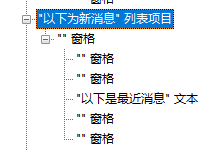

"加入群聊消息"
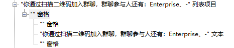

### 我发送的消息
"我发的表情"
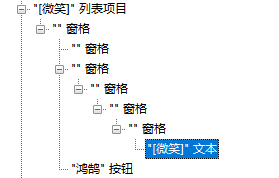

"我发出的语音"
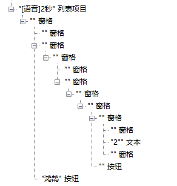

"图片"
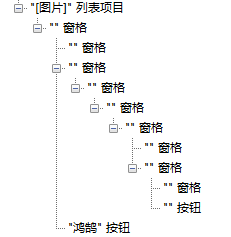

"exe文件"
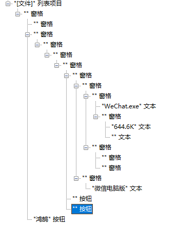
### 对方发送的消息
"对方发的表情"
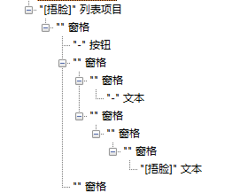

"对方发的语音"
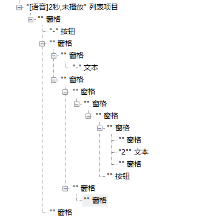

"图片"
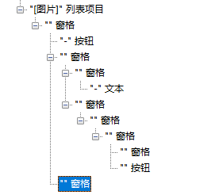

"压缩文件（.7z）"
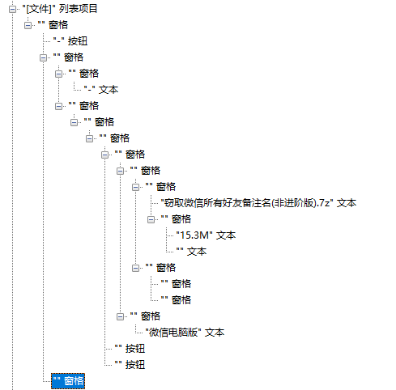

"word文件"
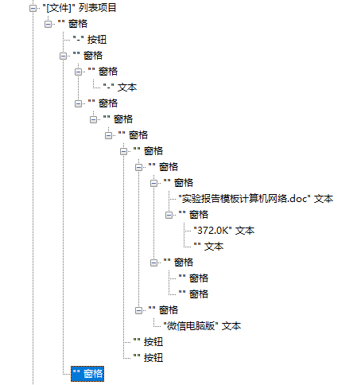

## 缺点
通过读取控件来分辨人的bug确实依旧存在
对于群聊只能通过读取读取对方的备注名实现人员识别，也就是对方可是实现取同一名来混淆同一个人，权限隔离问题