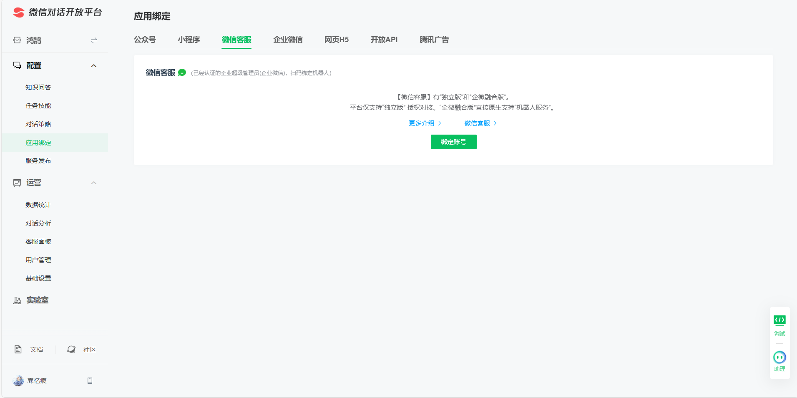

# <center>(WCBO)微信后台操作</center>
WCBO = WeChat background operation
- 微信多开控制
- 
- 好友或群聊消息监听
- deepseek自动回复
- 关键词自动回复(指定内容或AI处理)
- 处理加好友和加群的

## 注意事项
1. 2025年5月25号开始立项研发，微信版本：3.9.12.51(当时微信自检为最新)。下载链接：https://dldir1v6.qq.com/weixin/Windows/WeChatSetup.exe
2. 2025年5月28号，微信版本：4.0.5.18。这个版本UI大改，bug也多，最主要的还是无法正常读取控件
3. 此文章最后记录了微信4.0的笔记，有于3.9版本具体的对比描述
4. **严格避免高频率操作：** 新注册账号应避免在短时间内执行大量添加群组或联系人请求。此类行为极易触发腾讯的安全风控机制，导致账号被判定为存在异常或潜在风险
5. **单系统单账号原则：** 出于系统稳定性、资源管理及安全性考量，强烈建议在单一操作系统实例中仅部署并运行一个微信客户端。若在同一系统内尝试运行多个微信实例（多开），需具备完善的异步处理、同步机制及并发控制能力。否则，极易引发资源竞争、死锁（Deadlock）、任务调度混乱（如消息错发、状态不一致）等严重问题。
6. **环境有效性检查：** 成功启动并登录微信客户端后，点击界面左上角的用户头像应弹出个人信息面板。（如果没有请自行查找原因）
   1. 微信昵称
   2. 微信号
   3. 地区信息
7. 无论是4.0还是3.0版本，群聊的微信红包和个人转账只能在手机里面领取，只有私发的微信红包和转账能接收。


***

## 致命缺点(控件歧义)
如果是通过uiautomation读取就会有一个致命缺点:身份唯一标识符难以确认。
1. 一个群聊内可以出现2个名字相同的人，仅仅读取对方的名字无法判断是否为我要发送的人
2. 如果我给对方设置备注名那么重名后也无法确实这是不是我要真正发送的好友群聊重名依旧会导致判定失效 ，

在此次开发中我将对这个致命问题进行处理，这不仅仅是wxauto存在的问题(包括wxauto的400元付费plus版本)，在我的QQBot开发中早已体验了这个问题。
QQBot的解决方案
1. “权限隔离功能”，引入 “高级权限者”和 “超管”两级高权限角色，关键操作权限被高度集中，仅限这些特定角色执行。通过设置高权限角色门槛，显著缩小了具备执行敏感操作或知晓核心信息的身份者范围。其**核心思想**是：限制知晓关键身份的人数降低暴露风险(目标模糊化)达到身份验证缺失
2. 密码限制，如果要使用某些操作得要附带上密码(如退出)
3. 直接去除敏感操作。设置标志位，在程序直接不给用户提供敏感操作接口


***

## 微信自动回复实现方向及代价
| 实现方向 | 正规性 | 限制 | 代价 |
| -------- | ------ | ---- | ---- |
| 企业微信机器人 | 官方API，安全稳定 | 必须先加入对应的企业、配置繁琐、无法参与群聊  | 公网IP的云服务器 |
| 企业微信客服号 | 官方API，安全稳定、不用加企业，点开即用 | 未认证企业只能服务100人、配置繁琐、无法参与群聊 | 公网IP的云服务器 | 
| 公众号订阅号 | 官方API，安全稳定 | 超时限制，字数限制、无法参与群聊 | 公网IP的云服务器 |
| 公众号服务号 | 官方API，安全稳定 | 无法参与群聊、部署成本较高 | 公网IP的云服务器、服务号认证费用、营业执照 |
| 个人微信 | 参与群聊加好友、部署成本低、普通微信号的一切功能 | 给账号带来风险、建议用小号 | |
API逆向、爬虫 | 非官方(实力不够会封) | 技术难度高 | 号多、喜欢研究 |

- 微信官方文档：https://developers.weixin.qq.com/doc/
- 微信对话开放平台：https://chatbot.weixin.qq.com/@eggaa1fc/platform/openAi/home


## 微信能发送的消息类型(数据类型)
1. 最常见的就是文本，单纯的文本(时间也是嵌入消息里面和QQ一样)
2. 引用类型(引用后附加的只能是文本类型)，引用别人的消息体。**引用类型加文件自动变成文件类型**
3. 语音
4. 表情
   1. 官方表情
   2. 非官方表情
5. 
6. 文件类型
   1. 图片
   2. 视频
   3. pdf
   4. word
   5. ppt
   6. excel
   7. 等等


## 控件歧义消除（Control Ambiguity Resolution）
此课题在QQBot的时候就困住我了，这里我将对他进行解决
问题原因：窗口名字、群聊名字、好友名字、群聊内人员的名字都可以进行重复。这就导致无法正确判定控件是否有效

### 应用场景：
1. 正常消息发送时如果出现2个及以上同名的好友或群聊就无法判断究竟发给谁了
2. 开启权限隔离时需要正确判断发送者(某些指令如退出指令需要进行判断)

### 实现方向

### 1. 窗口绑定歧义消除

**能在窗口绑定产生歧义的就只有微信多开的情况**, 如果微信多开且名字相同又得更麻烦了，需要通过控件(微信号、或图像)进一步确认了
#### 业务逻辑思路：
1. 遍历顶层窗口，对于微信窗口这个顶层窗口控件可以通过类名(`ClassName`)判断，微信类名是："WeChatMainWndForPC" 微信聊天窗口的类名是:"ChatWnd"。通过类名和标题过滤掉非微信窗口(仅仅有1种情况是误判过滤窗口的，必须后台点击头像，这里就不纳入考虑了，这是非正常情况)
2. 拿到过滤后窗口读取头像控件的名字(微信名)，如果微信名重名则进行下一步
3. 遍历同名的微信窗口，后台点击头像按钮进一步读取微信号进行判断

### 2. 聊天同名歧义消除**
1. 天花板方案：给腾讯交钱(黑产)
2. 顶级方案：逆向微信的API接口，hook发送者的微信ID用来识别
3. 兜底方案：通过模拟点击的方案进行(如点击对方头像，群聊详细信息等) 等获得更多信息进行比对。判定用户用微信ID，群聊比较麻烦(拿到群主名或群名等更多信息进行比对)
4. 次级方案：拿到控件的图像进行对比
5. 垃圾方案：发现同名让用户改名(这是代码实现难度最低，收益最高的方案)

### 3. 控件歧义记录
1. 好友和好友同名
2. 群聊和好友同名
3. 群聊和群聊同名
4. 微信窗口同名，比如我把好友窗口单独拉出备注名改成

***

如何获取好友列表微信号？
参考资料：https://github.com/automation9417/application-automation/tree/master/WechatSearch
需要解决：怎么获取所有微信好友，因为好友列表需要鼠标滚动才能逐步显示完全，但是通过鼠标滚动的话，又存在一个问题，每次滚动显示好友列表数量不好控制？这时候可以利用先选中好友列表第一个，然后按键盘上 Down 键，就可以发现按一次，好友列表下移一次
1. 点击微信侧边栏通讯录
2. 点击好友列表第一个
3. 开始循环发送快捷键{DOWN}
4. 获取当前选中微信好友微信号
   1. 通过Recorder 我们可以很轻松定位到微信号，但是怎么获取相邻元素显示微信号呢？这时候可以通过 ui(locator.wechat.contact_id).parent.child(1).get_text()方式获取，逻辑就是定位到微信号元素后，再通过代码获取父一级元素即可；
5. 判断当前选中是微信群还是企业微信号
   1. 通过录制判断，我们可以发现只有微信好友才会显示微信号，所以通过这个特征来区分
6. 判断下移好友列表到底
   1. 通过记录上一次微信和当前选中微信号，如果上一次微信号和当前微信号一致，就可以判断可以结束流程

***

## 调用示例
***以下示例均为后台点击操作，如需修改为前台操作请自行覆写***
无法调用没有的控件，如未开启朋友圈功能就无法调用相关方法(如点击朋友圈的方法)，没有必要担心因为某个功能没有开启就一定会报错，代码中都做了处理(仅录入存在的功能，没有开启的皆为None)
### 1. 导包和实例化对象
导包
```python
from wcbo import WeChatBackgroundOperation   # 导入WeChatBackgroundOperation类
```

根据自己的需求实例化化对象
`wc = WeChatBackgroundOperation("微信名","微信号",True)`
参数：
wc_name ： 微信名，默认None(仅在控制多个微信时需要填写)
wc_id : 微信号，默认None(仅在控制多个微信时需要填写)
init_min_win : 默认True初始化时最小化窗口(为了方便开发可以改为False)
1. 当前仅仅开了一个微信
```python
wc = WeChatBackgroundOperation() # 实例化对象
# 打印输出消息是否实例化对象成功
print(f"实验微信名：{wc.wc_name}\n实验微信ID：{wc.wc_id}\n实验微信地区：{wc.wc_area}")
```

2. 多开微信后需要绑定的指定的微信，填入"微信名"和"微信号"用来绑定需要控制的微信（这里不必考虑微信同名问题，出现同名就用微信号判断）
```python
wc = WeChatBackgroundOperation("微信名", "微信号") # 实例化对象
# 打印输出消息是否实例化对象成功
print(f"实验微信名：{wc.wc_name}\n实验微信ID：{wc.wc_id}\n实验微信地区：{wc.wc_area}")
```

3. 如果需要前台查看点击效果，可以把第三个参数修改为Flase
```python
wc = WeChatBackgroundOperation("微信名", "微信号", False) # 实例化对象
# 打印输出消息是否实例化对象成功
print(f"实验微信名：{wc.wc_name}\n实验微信ID：{wc.wc_id}\n实验微信地区：{wc.wc_area}")
```
### 2. 窗口操作(标题栏)
- **窗口实现置顶、最小化、最大化、关闭等操作**
- **判断窗口是否能滚动，滚动窗口**

#### 控制窗口的方法(3种):
1. 通过win32api实现(强烈推荐这种，极致性能、精细控制或操作特殊窗口)。能对所有具有句柄的窗口使用该操作，减少底层com的开销比原生好使。
   ```python
   # wc.hwnd是微信窗口的句柄。下面的方法是对某个窗口进行控制，需要传入参数：窗口句柄
   wc.top_win(wc.hwnd)    # 置顶窗口
   wc.min_win(wc.hwnd)    # 最小化窗口
   wc.max_win(wc.hwnd)    # 最大化窗口
   wc.close_win(wc.hwnd)  # 关闭窗口
   wc.hide_win(wc.hwnd)   # 隐藏窗口
   wc.show_win(wc.hwnd)   # 展示窗口
   ```

2. 基于uiautomation自带的方法实现(只能操作绑定好的一个微信窗口)
   ```python
   wc.wc_win.SetTopmost(True)             # 置顶窗口
   wc.wc_win.Minimize()                   # 最小化窗口
   wc.wc_win.Maximize()                   # 最大化窗口
   wc.wc_win.GetWindowPattern().Close()   # 关闭窗口
   wc.wc_win.Hide(0)                      # 隐藏窗口
   wc.wc_win.Show(0)                      # 展示窗口
   ```

3. 通过后台点击窗口的标题栏按钮实现(微信没有隐藏窗口按钮、展示窗口需要自己重新点击微信)
   ```python
   wc.back_click(wc.top_button)    # 后台点击置顶按钮
   wc.back_click(wc.min_button)    # 后台点击最小化按钮
   wc.back_click(wc.max_button)    # 后台点击最大化按钮
   wc.back_click(wc.close_button)    # 后台点击关闭按钮
   ```

### 3. 导航栏按钮点击
#### 后台点击方法：
**方法:** `back_click(self, control)`
参数：control：控件对象。控件就是窗口，去类的属性里面找
按钮导航栏按钮后台点击示例：
```python
wc = WeChatBackgroundOperation()  # 实例化对象(单微信情况)
# wc = WeChatBackgroundOperation("微信名","微信号")  # 实例化对象(多开微信情况)
   wc.back_click(wc.chats_button)  # 点击聊天按钮
   wc.back_click(wc.contacts_button)  # 点击通讯录按钮
   wc.back_click(wc.favorites_button)  # 点击收藏按钮
   wc.back_click(wc.chat_files_button)  # 点击聊天文件按钮(按下之后显示在屏幕中间)
   wc.back_click(wc.moments_button)  # 点击朋友圈按钮(按下之后显示在右上角)
   wc.back_click(wc.channels_button)  # 点击视频号按钮(跟随原先配置)
   wc.back_click(wc.news_button)  # 点击看一看按钮(跟随原先配置)
   wc.back_click(wc.search_button)  # 点击搜一搜按钮(跟随原先配置)
   wc.back_click(wc.mini_programs_button)  # 点击小程序面板按钮(跟随原先配置)
   wc.back_click(wc.file_transfer_button)  # 点击手机(文件传输)按钮(跟随原先配置)
   wc.back_click(wc.settings_button)   # 点击设置或其它按钮
# 设置按钮有点奇特，需要自己仔细研究。
# 前台才能看到点击成功了，后台估计窗口失去焦点导致没有显示
```

#### 后台键盘
**方法:** back_key(self, control, vk_code)
参数：control：控件对象、vk_code  ： 虚拟按键码。控件就是窗口，去类的属性里面找
```python
wc = WeChatBackgroundOperation()  # 实例化对象(单微信情况)
# wc = WeChatBackgroundOperation("微信名","微信号")  # 实例化对象(多开微信情况)
wc.back_click(wc.search_box)  # 点击搜索框
# 输入框输入a
wc.back_key(wc.search_box, 65)  # 对搜索框发送a(65是a的按键码)
```

#### 窗口滚动相关
##### 判断窗口是否能滚动
   ```python
   wc = WeChatBackgroundOperation()  # 实例化对象(单微信情况)
   # wc = WeChatBackgroundOperation("微信名","微信号")  # 实例化对象(多开微信情况)
   wc.is_wheel(wc.wc_win)  # 判断微信这个窗口是否支持滚动
   # 输出：控件不支持滚动模式

   cts = Contacts(wc)  # 创建通讯录对象，传入整个微信客户端对象
   wc.is_wheel(cts.contacts_list_control)  # 传入通讯录列表控件判断是否能滚动
   # 输出：垂直滚动可用
   ```

##### 窗口列表滚动
列表控件百分比滚动(uiautomation原生支持的方法，并非是win32的api，但是可以实现后台操作)。<br>
可以通过给滚动列表的控件发送`Home`和`End`消息滚到最顶部和底部(简单理解就是在好友列表按下键盘的`Home`和`End`按键就能翻滚)。当然`PaUp`、`PaDn`、`↓`等按键也能滚动列表。

###### **方法1(后台列表滚动)**
`back_wheel(self, control, scroll_times = 1, direction = "down")`
1. control：控件对象
2. scroll_times ： 滚动次数(默认为1)
3. direction ： 滚动方向(默认为"down",向下)
```python
wc = WeChatBackgroundOperation()  # 实例化对象(单微信情况)
# wc = WeChatBackgroundOperation("微信名","微信号")  # 实例化对象(多开微信情况)
cts = Contacts(wc)  # 创建通讯录对象，传入整个微信客户端对象
# 调用back_wheel方法后台滚动
wc.back_wheel(cts.contacts_list_control)# 传入通讯录的通讯录列表控件
```

###### **方法2(前台列表滚动)**
`wheel(control, wheel_time=0.01, direction = "down")`
1. control：控件对象
2. wheel_time ： 滚动时间(默认滚动0.01秒)
3. direction ： 滚动反向(默认为"down"，向下)，不区分大小写。如果要大写就填`"up"`(字符串就行)
```python
wc = WeChatBackgroundOperation()  # 实例化对象(单微信情况)
# wc = WeChatBackgroundOperation("微信名","微信号")  # 实例化对象(多开微信情况)
cts = Contacts(wc)  # 创建通讯录对象，传入整个微信客户端对象
# 调用back_wheel方法后台滚动
wc.wheel(cts.contacts_list_control, 1) # 传入通讯录的通讯录列表控件，滚动1秒钟
```

###### **方法3**
`wheel(control, horizontal_percent = -1, vertical_percent = -1)`
1. 列表百分比滚动（必须要确保控件支持滚动和滚动可用）-1代表不动。
2. control：控件对象
3. horizontal_percent : 横向百分比(1-100)
4. vertical_percent : 纵向百分比(1-100)
**这个方法需要自行摸索，垂直移动逐渐+1去摸索这个百分比移动**
```python
wc = WeChatBackgroundOperation()  # 实例化对象(单微信情况)
# wc = WeChatBackgroundOperation("微信名","微信号")  # 实例化对象(多开微信情况)
cts = Contacts(wc)  # 创建通讯录对象，传入整个微信客户端对象
# 滚动好友列表(传入列表控件，-1为水平不移动，0为垂直移动到最开头)
wc.wheel(cts.contacts_list_control,-1,0)
```


### 4. 判断新消息
导航栏消息的接收：聊天、通讯录、收藏、聊天文件、朋友圈、视频号、看一看、搜一搜、小程序面板、手机(文件传输)、设置

核心方法：
***实例化对象后使用这些方法返回值都是布尔值(True或False)***
```python
is_new_messages   聊天

is_new_friend  通讯录

is_new_favorites  收藏

is_new_chat_files 聊天文件

is_new_moments 朋友圈

is_new_channels   视频号

is_new_news 看一看

is_new_search  搜一搜

is_new_mini_programs 小程序面板

is_new_file_transfer 手机(文件传输)

is_new_settings   设置
```
方法调用具体的例子：
```python
wc = WeChatBackgroundOperation()  # 实例化对象(单微信情况)
# wc = WeChatBackgroundOperation("微信名","微信号")  # 实例化对象(多开微信情况)
   print(f"聊天是否有新消息：{"有" if wc.is_new_messages() else "无"}")
   print(f"通讯录是否新消息：{"有" if wc.is_new_friend() else "无"}")
   print(f"收藏是否有新消息：{"有" if wc.is_new_favorites() else "无"}")
   print(f"聊天文件是否有新消息：{"有" if wc.is_new_chat_files() else "无"}")
   print(f"朋友圈是否有新消息：{"有" if wc.is_new_moments() else "无"}")
   print(f"视频号是否有新消息：{"有" if wc.is_new_channels() else "无"}")
   print(f"看一看是否有新消息：{"有" if wc.is_new_news() else "无"}")
   print(f"搜一搜是否有新消息：{"有" if wc.is_new_search() else "无"}")
   print(f"小程序面板是否有新消息：{"有" if wc.is_new_mini_programs() else "无"}")
   print(f"手机(文件传输)是否有新消息：{"有" if wc.is_new_file_transfer() else "无"}")
   print(f"设置是否有新消息：{"有" if wc.is_new_settings() else "无"}")

   # 判断受否有新的聊天消息
    if wc.is_new_messages():    # 有新的聊天消息
        print("有未读的聊天消息")
    else:       # 没有新的聊天消息
        print("没有需要处理的聊天消息")

"""输出结果：
聊天是否有新消息：无
通讯录是否新消息：无
收藏是否有新消息：无
聊天文件是否有新消息：无
朋友圈是否有新消息：无
视频号是否有新消息：无
看一看是否有新消息：无
搜一搜是否有新消息：无
小程序面板是否有新消息：无
手机(文件传输)是否有新消息：无
设置是否有新消息：无
没有需要处理的聊天消息
"""
```

***
## 通讯录相关操作
- 好友遍历
- 添加好友
- 
### 1. 好友遍历
***此操作本意是消除控件歧义(确保好友备注名的唯一性，防止发错人)，但是此操作极有可能被有心之人利用非法获取你的微信通讯录(父母、好友等)来进行诈骗***

### 遍历同名备注名的好友(消除控件歧义)
注意事项：星标好友是独立的，不会纳入字母遍历里面去

**方法：** `find_same_remark_name(self,sleep_time = 0.01, out = False)` 
参数：
sleep_time : 按键的间隔时间(必须设置，不然滚动太快导致控件无法读取)
out : 是否输出提示
```python
wc = WeChatBackgroundOperation("","", False)
cts = Contacts(wc)  # 创建通讯录对象，传入整个微信客户端对象

```


实现思路：
2、3方法抛弃，如果使用滚动，速度太快了，控件会丢失，我就直接使用向窗体发送向下的按键好了。与遍历好友消息不同

1. 后台发送向下的按键，获得当前控件的属性，性能没法像后2个方法强，但实际差不多。
2. 滚动前后记录2个列表(列表内容是备注名)，直接对比列表内容。
   1. 抛弃方法2，方法2还要多遍历一次控件运行ID，1只需要比例对比2个列表。
   2. 具体实现：
   缺点：假设列表1:`[1,2,3,4,4,4]`，列表2:`[4,4,5,6,7,8,9]`。此时结果本该是`[1,2,3,4,4,4,5,6,7,8,9]`但是实际为`[1,2,3,4,4,4,4,5,6,7,8,9]`多了个4，其实不影响同名结果
3. 滚动前后记录4个列表，2个列表是滚动前后的好友备注名，另外2个列表是滚动前后的运行时间，通过运行时间`RuntimeId`拿到唯一不重名的本体。


### 关键点说明：

1. **窗口查找**：
   - 使用`FindWindow(None, "窗口标题")`获取窗口句柄
   - 如果窗口标题不固定，可用`EnumWindows`遍历所有窗口

2. **参数构建**：
   - `lParam`包含扫描码和按键状态信息
   - 方向键需要设置扩展键标志位(24位)
   - 按下消息(`WM_KEYDOWN`)：扫描码 + 按下状态
   - 释放消息(`WM_KEYUP`)：设置转换状态位(31位)

3. **替代方案**：
   如果上述方法无效（如游戏窗口），可尝试驱动级模拟：
   ```python
   # 需要安装pywin32和ctypes
   import ctypes

   ctypes.windll.user32.keybd_event(0x28, 0, 0, 0)  # 按下
   ctypes.windll.user32.keybd_event(0x28, 0, 2, 0)  # 释放
   ```

### 常见问题排查：

1. **窗口未响应**：
   - 检查窗口是否禁用后台消息（如游戏）
   - 尝试先发送激活消息：`win32api.PostMessage(hwnd, win32con.WM_ACTIVATE, 1, 0)`

2. **权限问题**：
   - 以管理员身份运行Python脚本
   - 关闭UAC控制

3. **特殊程序处理**：
   ```python
   # 对于需要字符输入的程序，额外发送WM_CHAR
   win32api.PostMessage(hwnd, win32con.WM_CHAR, ord('A'), 0)
   ```

> 注意：某些安全程序（如反作弊系统）会拦截后台消息发送，这种情况下可能需要考虑其他方案。
***

## 微信4.0版本差异
1. 因为微信4.0版本后就改名了，原来是WeChat，现在直接是Weixin了
2. 微信版本4.0.5.18及以上，如果出现不适配就为4.0.5.18版本，定期更新微信适配版本
3. 消息无法同步，手机和电脑端的消息无法同步，必须电脑一直开着才能同步，并且如果电脑处理消息，手机则会丢失这个消息(bug)
4. 微信4.0版本及以上已经无法通过inspect.exe来获得完整的控件了，仅仅能读取的控件十分有限，UI大改
   1. 无法读取导航栏头像控件
   2. 无法读取群聊中发送者的名称
   3. 无法读取群聊中添加人到群聊的控件
5. 微信4.0版本出现视频广告弹窗(我当时正在研发，点击朋友圈后右下角出现视频广告弹窗声音拉满，我真服了，嵌入win的消息推送变成广告)
***


1.本项目是基于自主研发的DeepseekConversationEngine类库开发的示例程序，通过调用案例直观演示该库的功能特性与开发流程。
2.示例项目源码地址：https://github.com/yandifei/DeepseekConversationEngine/tree/main/调用示例/QQ机器人
3.核心类库仓库地址：https://github.com/yandifei/DeepseekConversationEngine
4.必须先在环境变量里配置好密钥，不懂的可以去看相关视频或查看文档目录下的deepseek对话引擎文件
5.优先查看文档解决问题，文档没有问AI(直接粘贴报错提示)或把报错发作者QQ邮箱:3058439878@qq.com
6.此程序的根本目的是打造接入DeepSeek的API接口实现“满分”的问题解答和为用户提供“情绪价值”
7.提供了预定的人设(已经调教好了)，文档中记载了自定义人设的方法，可自行查看修改
8.MIT协议保留原始版权可自由修改，禁止将该项目用于引流(带节奏)、纯色情、当键政等非法目的
9.如果您喜欢该项目或觉得该项目对您有所帮助，感谢您的使用。开源不易，如果可以请在项目根地址给我一个Start吧

如果要查看可使用的指令，请使用 #指令查询。注：普通成员可以开启权限隔离功能，但是开启后无权关闭